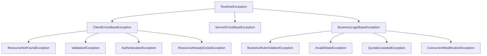

# Exceptions Guide

## 📋 Overview

The library provides a comprehensive exception hierarchy for consistent error handling across your application.

## 🏗️ Exception Hierarchy



## 🎯 Core Exception Usage

### Basic Exception Throwing

```java
// Resource not found
throw new ResourceNotFoundException(
    BaseAPICode.RESOURCE_NOT_FOUND,
    "User with ID '123' not found",
    "user-123"
);

// Validation error with field details
List<FieldError> fieldErrors = List.of(
    new FieldError("email", "INVALID_FORMAT", "Must be valid email"),
    new FieldError("password", "TOO_SHORT", "Must be at least 8 characters")
);
throw new ValidationException(
    BaseAPICode.VALIDATION_FAILED,
    "Invalid user data",
    fieldErrors
);

// Business rule violation
throw new BusinessRuleViolationException(
    BaseAPICode.BUSINESS_RULE_VIOLATION,
    "Insufficient account balance",
    Map.of("currentBalance", 50.0, "requiredAmount", 100.0)
);
```

## 🛠️ Fluent Builder Pattern

```java
// Using builders for cleaner code
throw ValidationException.builder(BaseAPICode.VALIDATION_FAILED)
    .message("Invalid registration data")
    .fieldError("email", "INVALID_FORMAT", "Must be valid email")
    .fieldError("password", "TOO_SHORT", "Must be at least 8 characters", "short")
    .build();

throw ResourceAlreadyExistsException.builder(BaseAPICode.RESOURCE_EXISTS)
    .message("User email already registered")
    .conflictingValue("user@example.com")
    .build();
```

## 🏢 Service Layer Examples

```java
public User createUser(CreateUserRequest request) {
    // Check if user exists
    if (userRepository.existsByEmail(request.email())) {
        throw new ResourceAlreadyExistsException(
            BaseAPICode.USER_ALREADY_EXISTS,
            "User with email already exists: " + request.email(),
            request.email()
        );
    }

    // Validate business rules
    if (!passwordService.meetsComplexity(request.password())) {
        throw new ValidationException(
            BaseAPICode.VALIDATION_FAILED,
            "Password does not meet complexity requirements",
            List.of(new FieldError("password", "INVALID_COMPLEXITY", "Must contain special characters"))
        );
    }

    // Check business constraints
    if (userRepository.countByTenant(request.tenantId()) >= MAX_USERS_PER_TENANT) {
        throw new QuotaExceededException(
            BaseAPICode.QUOTA_EXCEEDED,
            "User limit exceeded for tenant",
            Map.of("currentCount", userRepository.countByTenant(request.tenantId()),
                   "maxAllowed", MAX_USERS_PER_TENANT)
        );
    }

    return userRepository.save(request.toUser());
}
```

## 🛡️ Exception Selection Guide

| Scenario | Exception Type | HTTP Status |
|----------|---------------|-------------|
| Resource not found | `ResourceNotFoundException` | 404 |
| Validation errors | `ValidationException` | 400 |
| Business rule violations | `BusinessRuleViolationException` | 400 |
| Already exists | `ResourceAlreadyExistsException` | 409 |
| Permission denied | `UnauthorizedException` | 403 |
| Server errors | `InternalServerErrorException` | 500 |
| External service failures | `ExternalServiceException` | 502 |
| Invalid state | `InvalidStateException` | 400 |
| Quota exceeded | `QuotaExceededException` | 429 |
| Concurrent modification | `ConcurrentModificationException` | 409 |

## 🔄 Integration Examples

### Spring Boot Controller

```java
@RestController
@RequestMapping("/api/users")
public class UserController {

    @PostMapping
    public ResponseEntity<APIResponse<User>> createUser(@Valid @RequestBody CreateUserRequest request) {
        try {
            User user = userService.createUser(request);
            return ResponseEntity.ok(APIResponse.success(user, BaseAPICode.USER_CREATED));

        } catch (ResourceAlreadyExistsException ex) {
            // Let the global handler convert it to APIResponse
            throw ex;
        }
    }

    @GetMapping("/{id}")
    public User getUser(@PathVariable String id) {
        return userService.getUserById(id)
            .orElseThrow(() -> new ResourceNotFoundException(
                BaseAPICode.USER_NOT_FOUND,
                "User not found with ID: " + id,
                id
            ));
    }
}
```

### Service Layer with Complex Business Logic

```java
@Service
public class OrderService {

    public Order processOrder(OrderRequest request) {
        // Check resource existence
        Product product = productRepository.findById(request.productId())
            .orElseThrow(() -> new ResourceNotFoundException(
                BaseAPICode.RESOURCE_NOT_FOUND,
                "Product not found: " + request.productId(),
                request.productId()
            ));

        // Validate business rules
        if (!product.isAvailable()) {
            throw new InvalidStateException(
                BaseAPICode.INVALID_STATE,
                "Product is not available for purchase",
                product.getStatus(),
                "AVAILABLE"
            );
        }

        // Check inventory
        if (product.getStock() < request.quantity()) {
            throw new BusinessRuleViolationException(
                BaseAPICode.BUSINESS_RULE_VIOLATION,
                "Insufficient stock",
                Map.of("availableStock", product.getStock(),
                       "requestedQuantity", request.quantity())
            );
        }

        // Process order
        return orderRepository.save(createOrder(request, product));
    }
}
```

## 🎯 Best Practices

### ✅ Do:
- Use specific exception types for different error scenarios
- Provide meaningful error messages for clients
- Include relevant details for debugging
- Use builders for complex exception creation
- Let global handlers convert exceptions to responses

### ❌ Don't:
- Catch exceptions just to re-throw generic ones
- Expose sensitive information in error responses
- Use exceptions for control flow
- Create exception types for trivial scenarios

## 🔧 Custom Exceptions

### Creating Custom Exception Types

```java
public class CustomBusinessException extends BusinessLogicBaseException {
    
    public CustomBusinessException(APICode apiCode, String message, Map<String, Object> details) {
        super(apiCode, message, details);
    }
    
    public static CustomBusinessExceptionBuilder builder(APICode apiCode) {
        return new CustomBusinessExceptionBuilder(apiCode);
    }
}

// Usage
throw CustomBusinessException.builder(CustomAPICode.CUSTOM_ERROR)
    .message("Custom business rule violation")
    .detail("reason", "Some business reason")
    .build();
```

## 📋 Response Examples

### Validation Error Response
```json
{
  "status": 400,
  "error": {
    "code": "VALIDATION_FAILED",
    "message": "Invalid input data",
    "fieldErrors": [
      {
        "field": "email",
        "code": "INVALID_FORMAT",
        "message": "Must be valid email",
        "rejectedValue": "invalid-email"
      }
    ]
  },
  "message": "Invalid input data",
  "timestamp": "2023-10-05T12:34:56.789Z"
}
```

### Business Error Response
```json
{
  "status": 400,
  "error": {
    "code": "BUSINESS_RULE_VIOLATION",
    "message": "Insufficient account balance",
    "details": {
      "currentBalance": 50.0,
      "requiredAmount": 100.0
    }
  },
  "message": "Insufficient account balance",
  "timestamp": "2023-10-05T12:34:56.789Z"
}
```

## 🛡️ Global Exception Handling

### Spring Boot Global Handler

```java
@ControllerAdvice
public class GlobalExceptionHandler extends BaseResponseAdapter {
    
    @ExceptionHandler(Exception.class)
    public ResponseEntity<APIResponse<?>> handleAnyException(Exception ex) {
        APIResponse<?> response = handleException(ex);
        return ResponseEntity.status(response.status()).body(response);
    }
}
```

The `BaseResponseAdapter` automatically converts exceptions to appropriate `APIResponse` objects with proper status codes and error formats.